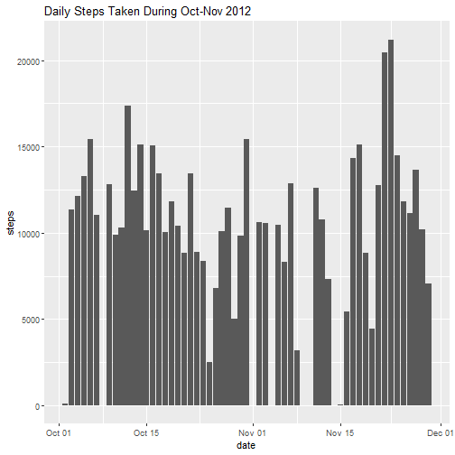
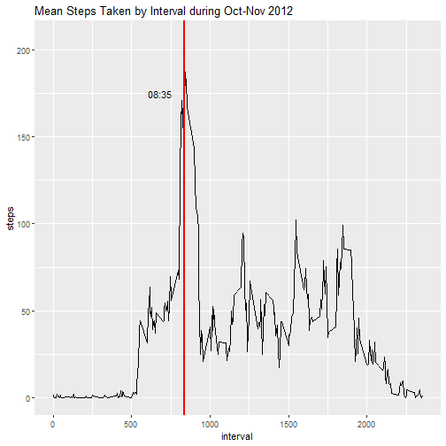
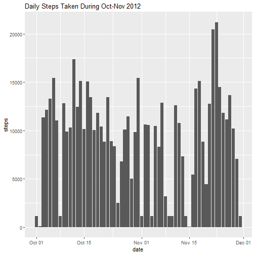
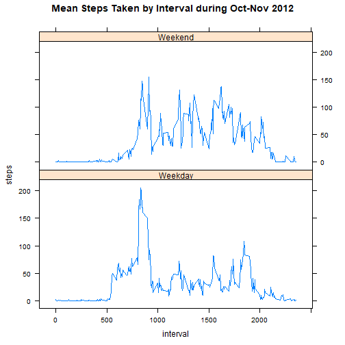

## Coursera | Reproducible Research | Week 2 Assignment

***

### 1. Loading and Preprocessing the Data


```r
## steps 1-2
data <- read.csv("activity.csv", sep = ',', colClasses = c("integer", "Date", "integer"))
```


### 2. Sum and Mean/Median Steps Taken Per Day


```r
library(ggplot2)

## 1a) obtain complete cases (no missing steps values) from initial processed data.frame (data) 
data.na.rm <- data[!is.na(data[, 1]), ]

## 1b) produce histogram of total number of steps by date
ggplot(data = data.na.rm, aes(date, steps)) + geom_col() + 
        labs(title = "Daily Steps Taken During Oct-Nov 2012")
```



```r
## 2a) mean steps taken per day
mean(data.na.rm$steps)
```

```
## [1] 37.3826
```

```r
## 2b) median steps taken per day
median(data.na.rm$steps)
```

```
## [1] 0
```

### 3. Mean Daily Activity Pattern


```r
## 1a) create data.frame object showing aggregate average steps for each unique 5-minute interval
stepsAvg <- aggregate(data.na.rm, by = list(data.na.rm$interval), mean)[, c(4, 2)]

## 1b) create time series plot (average steps ~ interval) from above data.frame object
ggplot(stepsAvg, aes(interval, steps)) + geom_path() + 
        labs(title = "Mean Steps Taken by Interval during Oct-Nov 2012") +
        geom_vline(aes(xintercept = stepsAvg[which.max(stepsAvg$steps), 1]), 
                   color = "red", size = 1) +
        annotate("text", x = stepsAvg[which.max(stepsAvg$steps), 1]-150, 
                 y = 175, label = "08:35")
```



### 4. Imputing Missing Values


```r
## 1) determine number of missing values (complement of complete cases)
sum(!complete.cases(data))
```

```
## [1] 2304
```

```r
## 2) strategy for imputing missing steps values from initial processed data.frame (data)

## obtain cases with missing steps values (data.na) from initial processed data.frame (data) 
## obtain complete cases from initial processed data.frame (data) 
## calculate median steps by interval from complete cases (to replace missing values in data.na$steps) 
data.na <- data[!complete.cases(data), ]
stepsMedian <- aggregate(data[complete.cases(data), ], 
        by = list(data[complete.cases(data), ]$interval), median)[, c(4, 2)]

## 3) create new imputed data set by merging incomplete cases (missing steps values) with stepsMedian
data.na.imp <- merge(data.na, stepsMedian, by.x = "interval", by.y = "interval")[, c(4, 3, 1)]
colnames(data.na.imp) <- c("steps", colnames(data.na.imp[2:3]))
data.na.imp <- rbind(data[complete.cases(data), ], data.na.imp)

## 4a) use imputed data set (data.na.imp) to produce histogram of total number of steps by date  
ggplot(data = data.na.imp, aes(date, steps)) + geom_col() + 
        labs(title = "Daily Steps Taken During Oct-Nov 2012")
```



```r
## 4b) mean steps taken per day
mean(data.na.imp$steps)
```

```
## [1] 32.99954
```

```r
## 4b) median steps taken per day
median(data.na.imp$steps)
```

```
## [1] 0
```

```r
## 4c) percent difference between actual and imputed means
actualMean <- mean(data.na.rm$steps)
imputedMean <- mean(data.na.imp$steps)
round(100*(actualMean-imputedMean)/actualMean,1)
```

```
## [1] 11.7
```

```r
## 4d) difference between actual and imputed medians
actualMedian <- median(data.na.rm$steps)
imputedMedian <- median(data.na.imp$steps)
actualMedian - imputedMedian
```

```
## [1] 0
```

## 5. Activity Patterns on Weekdays and Weekends 


```r
## 1) add factor variable to imputed data (data.na.imp) indicating if date is weekend or weekday
data.na.imp$Wknd <- as.factor(ifelse(weekdays(data.na.imp$date) %in% c("Saturday","Sunday"), 
        "Weekend", "Weekday"))

## 2) create time series plot of steps ~ interval using weekday/weekend factor for conditioning

## obtain aggregate mean steps by interval and by weekend 
stepsMeanImp <- aggregate(data.na.imp[, c(1, 3, 4)], 
        by = list(interval = data.na.imp$interval, Wknd = data.na.imp$Wknd), mean)[, 1:3]

## create lattice time series plot
library(lattice)
xyplot(steps ~ interval | Wknd, data = stepsMeanImp, layout = c(1, 2), 
        type = "l", main = "Mean Steps Taken by Interval during Oct-Nov 2012")
```


